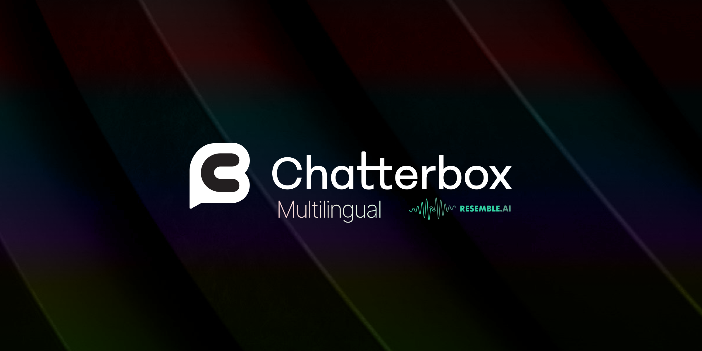

# Chatterbox TTS

[](https://resemble-ai.github.io/chatterbox_demopage/)
[](https://huggingface.co/spaces/ResembleAI/Chatterbox-Multilingual-TTS)
[](https://podonos.com/resembleai/chatterbox)
[](https://discord.gg/rJq9cRJBJ6)

*Made with ♥️ by* <a href="https://resemble.ai" target="_blank"></a>

**Chatterbox** is a family of state-of-the-art, open-source text-to-speech models by Resemble AI.

## Latest Release: Chatterbox Multilingual V3

**Chatterbox Multilingual V3** is the latest general-purpose multilingual TTS model in the Chatterbox family. It keeps the same 0.5B model size while improving speaker similarity, reducing hallucinations, and producing more natural, conversational speech across languages.

V3 is designed for broad language coverage like V2, but with stronger stability and more expressive generation. It is the recommended multilingual model for users who want one voice cloning model that works across many languages.

Alongside V3, we are releasing the **Single Language Pack**: dedicated finetunes for priority languages where tighter quality control, stronger language-specific behavior, and more specialized speech generation are valuable.

- **Broad Multilingual Coverage:** Designed as the main general-purpose multilingual Chatterbox model, supporting wide language coverage similar to V2.
- **Single Language Pack:** Dedicated single-language models provide stronger specialization and quality control where language- and regional-dialect-specific performance matters most.
- **More Consistent Speaker Similarity:** Improves voice identity and accent preservation across languages, making cross-language voice cloning more stable and reliable.
- **Reduced Hallucination:** V3 is optimized to reduce unwanted continuation, repetition, and off-prompt speech, especially in cases where earlier multilingual models were less stable.

For low-latency English voice agents, **Chatterbox-Turbo** is our most efficient model. Built on a streamlined 350M parameter architecture, **Turbo** delivers high-quality speech with less compute and VRAM than our previous models. We have also distilled the speech-token-to-mel decoder, previously a bottleneck, reducing generation from 10 steps to just **one**, while retaining high-fidelity audio output.

**Paralinguistic tags** are now native to the Turbo model, allowing you to use `[cough]`, `[laugh]`, `[chuckle]`, and more to add distinct realism. While Turbo was built primarily for low-latency voice agents, it excels at narration and creative workflows.

If you like the model but need to scale or tune it for higher accuracy, check out our competitively priced TTS service (<a href="https://resemble.ai">link</a>). It delivers reliable performance with ultra-low latency of sub 200ms—ideal for production use in agents, applications, or interactive media.


### ⚡ Model Zoo

Choose the right model for your application.

| Model                                                                                                           | Size | Languages | Key Features                                            | Best For                                     | 🤗                                                                  | Examples |
|:----------------------------------------------------------------------------------------------------------------| :--- | :--- |:--------------------------------------------------------|:---------------------------------------------|:--------------------------------------------------------------------------| :--- |
| **Chatterbox-Turbo**                                                                                            | **350M** | **English** | Paralinguistic Tags (`[laugh]`), Lower Compute and VRAM | Zero-shot voice agents,  Production          | [Demo](https://huggingface.co/spaces/ResembleAI/chatterbox-turbo-demo)        | [Listen](https://resemble-ai.github.io/chatterbox_turbo_demopage/) |
| **Chatterbox-Multilingual V3** [(Language list)](#supported-languages)                                          | **500M** | **23+** | Improved speaker similarity, reduced hallucinations, more natural multilingual speech | Global applications, localization, cross-language voice cloning | [Demo](https://huggingface.co/spaces/ResembleAI/Chatterbox-Multilingual-TTS) | [Listen](https://resemble-ai.github.io/chatterbox_demopage/) |
| **Single Language Pack** [(Models)](#single-language-pack)                                                      | 500M each | 6 dedicated finetunes | Language- and region-specific quality control           | Priority languages and dialect-sensitive applications | [Models](#single-language-pack) | [Demos](#single-language-pack) |
| Chatterbox [(Tips and Tricks)](#original-chatterbox-tips)                                                       | 500M | English | CFG & Exaggeration tuning                               | General zero-shot TTS with creative controls | [Demo](https://huggingface.co/spaces/ResembleAI/Chatterbox)              | [Listen](https://resemble-ai.github.io/chatterbox_demopage/) |

## Installation
```shell
pip install chatterbox-tts
```

Alternatively, you can install from source:
```shell
# conda create -yn chatterbox python=3.11
# conda activate chatterbox

git clone https://github.com/resemble-ai/chatterbox.git
cd chatterbox
pip install -e .
```
We developed and tested Chatterbox on Python 3.11 on Debian 11 OS; the versions of the dependencies are pinned in `pyproject.toml` to ensure consistency. You can modify the code or dependencies in this installation mode.

## Usage

##### Chatterbox-Turbo

```python
import torchaudio as ta
import torch
from chatterbox.tts_turbo import ChatterboxTurboTTS

# Load the Turbo model
model = ChatterboxTurboTTS.from_pretrained(device="cuda")

# Generate with Paralinguistic Tags
text = "Hi there, Sarah here from MochaFone calling you back [chuckle], have you got one minute to chat about the billing issue?"

# Generate audio (requires a reference clip for voice cloning)
wav = model.generate(text, audio_prompt_path="your_10s_ref_clip.wav")

ta.save("test-turbo.wav", wav, model.sr)
```

##### Chatterbox and Chatterbox-Multilingual

```python

import torchaudio as ta
from chatterbox.tts import ChatterboxTTS
from chatterbox.mtl_tts import ChatterboxMultilingualTTS

device = "cuda"  # or "cpu" / "mps"

# English example
model = ChatterboxTTS.from_pretrained(device=device)

text = "Ezreal and Jinx teamed up with Ahri, Yasuo, and Teemo to take down the enemy's Nexus in an epic late-game pentakill."
wav = model.generate(text)
ta.save("test-english.wav", wav, model.sr)

# Multilingual V3 examples
multilingual_model = ChatterboxMultilingualTTS.from_pretrained(device=device, t3_model="v3")
# To use the legacy V2 multilingual checkpoint, omit t3_model or pass t3_model="v2".

french_text = "Bonjour, comment ça va? Ceci est le modèle de synthèse vocale multilingue Chatterbox, il prend en charge 23 langues."
wav_french = multilingual_model.generate(french_text, language_id="fr")
ta.save("test-french.wav", wav_french, multilingual_model.sr)

chinese_text = "你好，今天天气真不错，希望你有一个愉快的周末。"
wav_chinese = multilingual_model.generate(chinese_text, language_id="zh")
ta.save("test-chinese.wav", wav_chinese, multilingual_model.sr)

# If you want to synthesize with a different voice, specify the audio prompt
AUDIO_PROMPT_PATH = "YOUR_FILE.wav"
wav = model.generate(text, audio_prompt_path=AUDIO_PROMPT_PATH)
ta.save("test-2.wav", wav, model.sr)
```
See `example_tts.py` and `example_vc.py` for more examples.

## Supported Languages
The general-purpose Chatterbox Multilingual model supports the following languages:

Arabic (ar) • Danish (da) • German (de) • Greek (el) • English (en) • Spanish (es) • Finnish (fi) • French (fr) • Hebrew (he) • Hindi (hi) • Italian (it) • Japanese (ja) • Korean (ko) • Malay (ms) • Dutch (nl) • Norwegian (no) • Polish (pl) • Portuguese (pt) • Russian (ru) • Swedish (sv) • Swahili (sw) • Turkish (tr) • Chinese (zh)

## Single Language Pack

The Single Language Pack provides dedicated finetunes for priority languages and regional variants. Use these when you want stronger language-specific behavior, tighter quality control, or dialect-aware generation beyond the general multilingual model.

| Language | Model Card | Demo Space |
| --- | --- | --- |
| Chinese | [ResembleAI/Chatterbox-Multilingual-zh-cmn](https://huggingface.co/ResembleAI/Chatterbox-Multilingual-zh-cmn) | [Demo](https://huggingface.co/spaces/ResembleAI/Chatterbox-Multilingual-TTS-zh-cmn) |
| Latam Spanish | [ResembleAI/Chatterbox-Multilingual-es-mx-latam](https://huggingface.co/ResembleAI/Chatterbox-Multilingual-es-mx-latam) | [Demo](https://huggingface.co/spaces/ResembleAI/Chatterbox-Multilingual-TTS-es-mx-latam) |
| Brazilian Portuguese | [ResembleAI/Chatterbox-Multilingual-pt-br](https://huggingface.co/ResembleAI/Chatterbox-Multilingual-pt-br) | [Demo](https://huggingface.co/spaces/ResembleAI/Chatterbox-Multilingual-TTS-pt-br) |
| Spain Spanish | [ResembleAI/Chatterbox-Multilingual-es-es](https://huggingface.co/ResembleAI/Chatterbox-Multilingual-es-es) | [Demo](https://huggingface.co/spaces/ResembleAI/Chatterbox-Multilingual-TTS-es-es) |
| Portugal Portuguese | [ResembleAI/Chatterbox-Multilingual-pt-pt](https://huggingface.co/ResembleAI/Chatterbox-Multilingual-pt-pt) | [Demo](https://huggingface.co/spaces/ResembleAI/Chatterbox-Multilingual-TTS-pt-pt) |
| Hindi | [ResembleAI/Chatterbox-Multilingual-hi](https://huggingface.co/ResembleAI/Chatterbox-Multilingual-hi) | [Demo](https://huggingface.co/spaces/ResembleAI/Chatterbox-Multilingual-TTS-hi) |

## Original Chatterbox Tips
- **General Use (TTS and Voice Agents):**
  - Ensure that the reference clip matches the specified language tag. Otherwise, language transfer outputs may inherit the accent of the reference clip’s language. To mitigate this, set `cfg_weight` to `0`.
  - The default settings (`exaggeration=0.5`, `cfg_weight=0.5`) work well for most prompts across all languages.
  - If the reference speaker has a fast speaking style, lowering `cfg_weight` to around `0.3` can improve pacing.

- **Expressive or Dramatic Speech:**
  - Try lower `cfg_weight` values (e.g. `~0.3`) and increase `exaggeration` to around `0.7` or higher.
  - Higher `exaggeration` tends to speed up speech; reducing `cfg_weight` helps compensate with slower, more deliberate pacing.


## Built-in PerTh Watermarking for Responsible AI

Every audio file generated by Chatterbox includes [Resemble AI's Perth (Perceptual Threshold) Watermarker](https://github.com/resemble-ai/perth) - imperceptible neural watermarks that survive MP3 compression, audio editing, and common manipulations while maintaining nearly 100% detection accuracy.


## Watermark extraction

You can look for the watermark using the following script.

```python
import perth
import librosa

AUDIO_PATH = "YOUR_FILE.wav"

# Load the watermarked audio
watermarked_audio, sr = librosa.load(AUDIO_PATH, sr=None)

# Initialize watermarker (same as used for embedding)
watermarker = perth.PerthImplicitWatermarker()

# Extract watermark
watermark = watermarker.get_watermark(watermarked_audio, sample_rate=sr)
print(f"Extracted watermark: {watermark}")
# Output: 0.0 (no watermark) or 1.0 (watermarked)
```


## Official Discord

👋 Join us on [Discord](https://discord.gg/rJq9cRJBJ6) and let's build something awesome together!

## Evaluation
Chatterbox Turbo was evaluated using Podonos, a platform for reproducible subjective speech evaluation.

We compared Chatterbox Turbo to competitive TTS systems using Podonos' standardized evaluation suite, focusing on overall preference, naturalness, and expressiveness.

Evaluation reports:
- [Chatterbox Turbo vs ElevenLabs Turbo v2.5](https://podonos.com/resembleai/chatterbox-turbo-vs-elevenlabs-turbo)
- [Chatterbox Turbo vs Cartesia Sonic 3](https://podonos.com/resembleai/chatterbox-turbo-vs-cartesia-sonic3)
- [Chatterbox Turbo vs VibeVoice 7B](https://podonos.com/resembleai/chatterbox-turbo-vs-vibevoice7b)

These evaluations were conducted under identical conditions and are publicly accessible via Podonos.

## Acknowledgements
- [Podonos](https://podonos.com) — for supporting reproducible subjective speech evaluation
- [Cosyvoice](https://github.com/FunAudioLLM/CosyVoice)
- [Real-Time-Voice-Cloning](https://github.com/CorentinJ/Real-Time-Voice-Cloning)
- [HiFT-GAN](https://github.com/yl4579/HiFTNet)
- [Llama 3](https://github.com/meta-llama/llama3)
- [S3Tokenizer](https://github.com/xingchensong/S3Tokenizer)

## Citation
If you find this model useful, please consider citing.
```
@misc{chatterboxtts2025,
  author       = {{Resemble AI}},
  title        = {{Chatterbox-TTS}},
  year         = {2025},
  howpublished = {\url{https://github.com/resemble-ai/chatterbox}},
  note         = {GitHub repository}
}
```
## Disclaimer
Don't use this model to do bad things. Prompts are sourced from freely available data on the internet.
